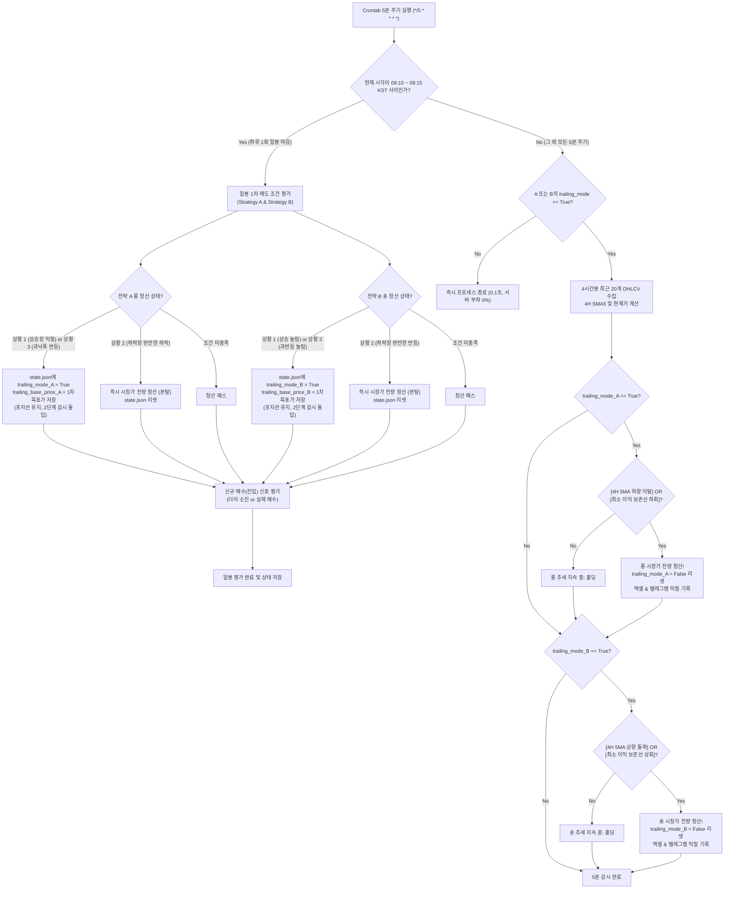

# `bitget_v3_switch` 2단계 스마트 트레일링 익절 (1차/2차 매도) 구현 계획서

본 문서는 V3+(Long DCA) 및 V3-(Short DCA) 전략에서 일봉 기준 1차 목표가 달성 시 조기 익절을 방지하고, 4시간봉 5MA 추세 추종 및 최소 이익 보존선을 활용하여 추세를 끝까지 극대화하는 **2단계 스마트 트레일링 매도(청산) 시스템**의 상세 구현 계획서입니다.

> [!IMPORTANT]
> **모드 정책 준수 안내 (`/ask` 전용)**
> 본 문서는 `/ask` 규칙에 따라 작성된 계획서이며, **프로젝트 소스 코드를 아직 수정하지 않았습니다**.  
> 계획서를 검토하신 후 **`/apply`** 명령어를 입력하시면 본 계획서에 정의된 단계에 따라 실제 소스 코드 반영 및 터미널 정적 검증(`py_compile`)이 즉시 집행됩니다.

---

## 1. 시스템 아키텍처 및 2단계 청산 워크플로우



---

## 2. 전략별 1차 및 2차 세부 매도 규칙 명세

### 1) 전략 A (Long DCA: V3+)

* **1단계 확인 (09:10 ~ 09:15 KST, 일봉 마감 기준):**
  * **상황 1 (60일선 상승 중):** 현재가 $\ge SMA5_{1d} \times 1.02$ 도달 시  
    $\rightarrow$ **2단계 감시 모드 돌입** (`trailing_mode = True`, `trailing_base_price = SMA5 * 1.02`)
  * **상황 2 (60일선 하락 & 완만한 하락 $\text{낙폭률} > -30\%$):** 현재가 $\le SMA5_{1d} \times 0.99$ 도달 시  
    $\rightarrow$ **즉시 시장가 전량 청산 (빠른 본탈/약손절, 2단계 없음)**
  * **상황 3 (60일선 하락 & 과낙폭 $\text{낙폭률} \le -30\%$):** 현재가 $\ge SMA5_{1d} \times 1.03$ 도달 시  
    $\rightarrow$ **2단계 감시 모드 돌입** (`trailing_mode = True`, `trailing_base_price = SMA5 * 1.03`)
* **2단계 5분 주기 감시 (5분 간격 Crontab 실행):**
  * 다음 **둘 중 어느 하나라도 만족 시 즉시 롱 시장가 전량 매도**:
    1. **추세 꺾임:** 현재가 $<$ 4시간봉 $5MA$ 하향 이탈
    2. **최소 이익 보존선 방어:** 현재가 $\le$ `trailing_base_price` 하회 (슬리피지 방어 버퍼 적용)

---

### 2) 전략 B (Short DCA: V3-)

* **1단계 확인 (09:10 ~ 09:15 KST, 일봉 마감 기준):**
  * **상황 1 (60일선 상승 중 단기 눌림):** 현재가 $\le SMA5_{1d} \times 0.98$ 도달 시  
    $\rightarrow$ **2단계 감시 모드 돌입** (`trailing_mode = True`, `trailing_base_price = SMA5 * 0.98`)
  * **상황 2 (60일선 하락 & 완만한 반등 $\text{반등폭} < +30\%$):** 현재가 $\le SMA5_{1d} \times 1.01$ 도달 시  
    $\rightarrow$ **즉시 시장가 전량 청산 (빠른 본탈/약손절, 2단계 없음)**
  * **상황 3 (60일선 하락 & 과반등 후 깊은 눌림 $\text{반등폭} \ge +30\%$):** 현재가 $\le SMA5_{1d} \times 0.97$ 도달 시  
    $\rightarrow$ **2단계 감시 모드 돌입** (`trailing_mode = True`, `trailing_base_price = SMA5 * 0.97`)
* **2단계 5분 주기 감시 (5분 간격 Crontab 실행):**
  * 다음 **둘 중 어느 하나라도 만족 시 즉시 숏 시장가 전량 청산**:
    1. **추세 반등:** 현재가 $>$ 4시간봉 $5MA$ 상향 돌파
    2. **최소 이익 보존선 방어:** 현재가 $\ge$ `trailing_base_price` 상회 (상한선 방어)

---

## 3. 영속성 데이터 스키마 확장 (`state.json`)

각 전략 객체(`strategy_A`, `strategy_B`)에 2단계 트레일링 상태를 안전하게 영속 저장합니다.

```json
{
  "strategy_A": {
    "cycle_id": 1,
    "dummy_count": 0,
    "executed_units": 2,
    "avg_price": 38.5,
    "total_qty": 52.4,
    "cycle_peak": 42.0,
    "trailing_mode": true,
    "trailing_base_price": 40.8,
    "trailing_target_price": 40.8,
    "trailing_reason": "60일선 상승 중 1차 목표가($40.80) 도달 후 2단계 추세 감시",
    "trailing_triggered_at": "2026-10-08 09:13:00"
  },
  "strategy_B": {
    "cycle_id": 1,
    "dummy_count": 0,
    "executed_units": 0,
    "avg_price": 0.0,
    "total_qty": 0.0,
    "cycle_trough": 0.0,
    "trailing_mode": false,
    "trailing_base_price": 0.0,
    "trailing_target_price": 0.0,
    "trailing_reason": "",
    "trailing_triggered_at": null
  },
  "last_updated": "2026-10-08 09:13:00"
}
```

---

## 4. 파일별 세부 수정 계획

| 파일 경로 | 수정 목적 및 내용 |
| :--- | :--- |
| **`config.py`** | • 4시간봉 설정 상수 추가 (`TIMEFRAME_4H = "4h"`, `CANDLE_LIMIT_4H = 30`, `SMA_4H_PERIOD = 5`)<br/>• 일봉 1차 평가 시간 윈도우 상수 추가 (`DAILY_EVAL_HOUR_KST = 9`, `DAILY_EVAL_START_MIN = 10`, `DAILY_EVAL_END_MIN = 15`) |
| **`strategy/indicator.py`** | • `calculate_4h_indicators(df_4h)` 메서드 추가: 4시간봉 5MA(`sma5_4h`), 직전 4시간봉 5MA 및 현재가 이탈/돌파 판단 로직 구현 |
| **`strategy/strategy_a_long.py`** | • `check_exit_signal`을 1차 평가(`check_stage1_signal`)와 2차 평가(`check_stage2_signal`)로 분리<br/>• 상황 1, 3은 `ENTER_STAGE2`, 상황 2는 `IMMEDIATE_EXIT` 반환 |
| **`strategy/strategy_b_short.py`** | • 숏 전략에 맞게 1차 평가(`check_stage1_signal`)와 2차 평가(`check_stage2_signal`) 대칭 구현<br/>• 4H 5MA 상향 돌파 및 상한선(`trailing_base_price`) 도달 판정 |
| **`manager/cycle_manager.py`** | • `set_trailing_mode(strategy_name, target_price, base_price, reason)` 메서드 추가<br/>• `clear_trailing_mode(strategy_name)` 메서드 추가<br/>• `is_any_trailing_active()` 헬퍼 메서드 추가 |
| **`manager/trader.py`** | • `process_stage2_monitoring()` 신규 메서드 추가 (5분 주기 전용 청산 감시)<br/>• 1차 충족 시 청산 대신 `cycle_manager.set_trailing_mode` 활성화<br/>• 2차 충족 시 시장가 전량 청산 및 사이클 초기화 |
| **`main.py`** | • CLI 옵션에 `--cron` 추가: 5분 단위 실행 최적화 (09:10~09:15 외에는 trailing 미작동 시 0.1초 즉시 종료)<br/>• `--loop` 실행 시 5분 주기로 스케줄러 자동 구동 |

---

## 5. 단계별 구현 및 검증 로드맵 (`/apply` 실행 시)

1. **Step 1: 환경 설정 및 지표 계산기 확장 (`config.py`, `strategy/indicator.py`)**
   - 4시간봉 파라미터 등록 및 `calculate_4h_indicators` 단위 테스트
   - *검증: `python -m py_compile config.py strategy/indicator.py`*
2. **Step 2: A/B 전략 모듈 1차/2차 분기 구현 (`strategy/strategy_a_long.py`, `strategy/strategy_b_short.py`)**
   - 롱/숏 대칭 2단계 청산 로직 구현
   - *검증: `python -m py_compile strategy/strategy_a_long.py strategy/strategy_b_short.py`*
3. **Step 3: 상태 관리자 확장 (`manager/cycle_manager.py`, `state.json`)**
   - 트레일링 플래그 및 기준 가격 영속성 입출력 로직 구현
   - *검증: `python -m py_compile manager/cycle_manager.py`*
4. **Step 4: 주문 관리자 및 5분 모니터링 파이프라인 구현 (`manager/trader.py`)**
   - 09:10~09:15 일봉 마감 평가와 5분 주기 2차 감시 파이프라인 분리
   - *검증: `python -m py_compile manager/trader.py`*
5. **Step 5: 메인 엔트리 및 크론탭 CLI 지원 (`main.py`)**
   - `--cron`, `--loop`, `--run-once` 지원
   - *검증: `python -m py_compile main.py` 및 모의 4H/일봉 데이터 종합 시뮬레이션 검증*

---

## 6. 사용자 확인 및 승인 대기

* 본 계획서는 `/ask` 정책에 따라 작성되었으며, 사용자의 명시적인 승인 없이 코드가 자동으로 실행되지 않습니다.
* 위 계획대로 소스 코드를 반영하고 구현을 진행하시려면 **`/apply`** 명령어를 입력해 주시기 바랍니다.
