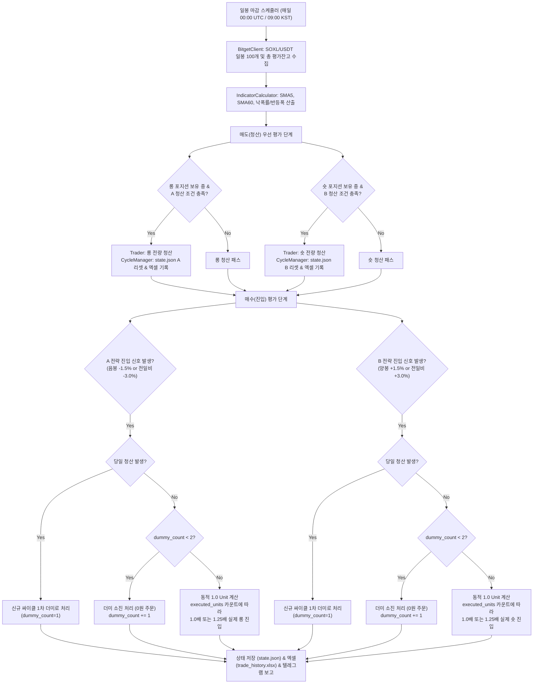

# `bitget_v3_switch` 자동매매 시스템 구현 계획서 (Implementation Plan)

본 문서는 [bitget_v3_switch_prd.md](file:///c:/Users/user/Desktop/trading_buddy/06비트겟자동매매-4기/week_00-bitget_v3_switch/docs/prd/bitget_v3_switch_prd.md) 요구사항 명세서를 바탕으로, 실제 프로덕션 수준의 안정성과 확장성을 갖춘 파이썬 자동매매 시스템의 모듈별 설계 및 구현 단계를 정의합니다.

> [!IMPORTANT]
> **모드 정책 준수 안내 (`/ask` 전용)**
> 본 문서는 `/ask` 모드에 따라 작성된 계획서 아티팩트이며, **프로젝트 소스 코드를 아직 변경하지 않았습니다**.  
> 사용자 승인 후 **`/apply`** 명령어를 입력하면 본 계획서에 따라 단계별 구현 및 터미널 정적 검증(`py_compile`)이 즉시 집행됩니다.

---

## 1. 시스템 아키텍처 및 핵심 워크플로우

---

## 2. 파일 및 모듈별 상세 설계 명세

### 1) 환경 설정 및 보안 (`config.py`, `.env.example`)
- **`config.py`**:
  - `python-dotenv`를 활용하여 안전하게 `.env` 환경변수를 로드합니다.
  - 심볼: `SOXL/USDT:USDT` (ccxt 선물 마켓 규격)
  - 마진/포지션 모드: Cross Margin, Hedge Mode (Dual-side position)
  - 파라미터 상수 정의:
    - `UNIT_DIVISOR = 10` (총 평가 잔고의 1/10)
    - `DUMMY_TARGET = 2` (2회 더미 소진 필수)
    - `WEIGHTED_UNIT_THRESHOLD = 4` (실제 매수 5회차부터 1.25배 가중)
    - `WEIGHT_NORMAL = 1.0`, `WEIGHT_BOOST = 1.25`
    - A 전략 임계값: 음봉 `-0.015`, 전일비 `-0.030`
    - B 전략 임계값: 양봉 `+0.015`, 전일비 `+0.030`
    - SMA 주기: 단기 `5`, 중기 `60`
    - 익절 계수: `1.02`, `0.99`, `1.03` (Long) / `0.98`, `1.01`, `0.97` (Short)
- **`.env.example`**:
  - `BITGET_API_KEY`, `BITGET_SECRET`, `BITGET_PASSPHRASE`
  - `TELEGRAM_BOT_TOKEN`, `TELEGRAM_CHAT_ID`
  - `IS_PAPER_TRADING` (모의 테스트 플래그)

### 2) 거래소 API 래퍼 (`api/bitget_client.py`)
- **`ccxt.bitget` 인스턴스 캡슐화**:
  - `options: {'defaultType': 'swap'}` 설정으로 USDT 선물 마켓 타겟팅
  - 시작 시 `set_position_mode(hedged=True, symbol)` 및 `set_leverage(1, symbol)` 자동 검증/강제 설정
- **핵심 메서드**:
  - `fetch_ohlcv(symbol, timeframe='1d', limit=100)`: 100일 분량 일봉 캔들 DataFrame 변환
  - `fetch_total_balance()`: Free Margin + Position Margin 합산 실시간 총 평가 자산($) 산출
  - `fetch_open_positions(symbol)`: 현재 Long 및 Short 각각의 보유 수량(`contracts`), 평단가(`entryPrice`), 미실현손익 수집
  - `create_hedge_order(symbol, side, amount, pos_side, order_type='market')`:
    - Long 진입: `side='buy'`, `pos_side='long'`
    - Long 청산: `side='sell'`, `pos_side='long'`
    - Short 진입: `side='sell'`, `pos_side='short'`
    - Short 청산: `side='buy'`, `pos_side='short'`
  - 최소 주문 수량(lot size) 및 가격 tick size 보정 (`exchange.amount_to_precision`)

### 3) 지표 계산 모듈 (`strategy/indicator.py`)
- 입력: 일봉 OHLCV DataFrame (최근 100일)
- 산출 지표:
  - $SMA_5$: 5일 단순 이동평균값
  - $SMA_{60}$: 60일 단순 이동평균값 (당일 및 전일 값으로 방향성 $SMA_{60} > SMA_{60, prev}$ 판단)
  - 캔들 등락률: `(close - open) / open`
  - 전일비 등락률: `(close - prev_close) / prev_close`
  - 싸이클 기준 낙폭률(Long) 및 반등폭(Short):
    - Long: $(\text{현재가} - \text{싸이클 전고점}) / \text{싸이클 전고점}$
    - Short: $(\text{현재가} - \text{싸이클 전저점}) / \text{싸이클 전저점}$

### 4) A/B 매매 전략 모듈 (`strategy/strategy_a_long.py`, `strategy/strategy_b_short.py`)
- **`StrategyALong`**:
  - `check_entry_signal(candle)`: 음봉 $\le -1.5\%$ OR 전일비 $\le -3.0\%$
  - `check_exit_signal(current_price, sma5, sma60_rising, drawdown_rate)`:
    - 상승장: `current_price >= sma5 * 1.02`
    - 하락장 & 낙폭률 $> -30\%$: `current_price <= sma5 * 0.99` (본전 탈출)
    - 하락장 & 낙폭률 $\le -30\%$: `current_price >= sma5 * 1.03` (과낙폭 반등 익절)
- **`StrategyBShort`**:
  - `check_entry_signal(candle)`: 양봉 $\ge +1.5\%$ OR 전일비 $\ge +3.0\%$
  - `check_exit_signal(current_price, sma5, sma60_rising, rebound_rate)`:
    - 상승장: `current_price <= sma5 * 0.98`
    - 하락장 & 반등폭 $< +30\%$: `current_price <= sma5 * 1.01` (본전 탈출)
    - 하락장 & 반등폭 $\ge +30\%$: `current_price <= sma5 * 0.97` (과반등 눌림 익절)

### 5) 사이클 및 자금 관리 (`manager/cycle_manager.py`, `state.json`)
- **`state.json` 영속성 보장**:
  - 원자적(Atomic) 파일 쓰기를 적용하여 프로세스 비정상 종료 시 손상 방지
  - 스키마에 싸이클 시작일, 싸이클 내 최고가(`cycle_peak`), 최저가(`cycle_trough`) 필드를 포함하여 낙폭률/반등폭을 안정적으로 트래킹
- **더미 및 유닛 배분 로직**:
  - 더미 카운트(`< 2`) 중에는 거래소 실주문 없이 상태 카운트만 증가 (`BUY_DUMMY`)
  - 3번째 신호부터 실주문 집행 (`BUY_UNIT`):
    - `0 <= executed_units < 4`: $1.0 \times \text{Unit Size}$
    - `executed_units >= 4`: $1.25 \times \text{Unit Size}$
  - 청산 시: `dummy_count=0`, `executed_units=0`, `total_qty=0`, `cycle_id += 1` 리셋

### 6) 주문 집행 및 포지션 동기화 (`manager/trader.py`)
- 잔고 기반 동적 1 Unit 금액 계산: $\text{Total Balance} / 10$
- 목표 투입 금액에 따른 토큰 수량 환산: $\text{Target Qty} = \text{Target \$} / \text{Current Price}$
- Bitget API 주문 파라미터 검증 및 체결 결과 피드백을 받아 `state.json` 평단가/수량 동기화

### 7) 로깅, 엑셀 및 텔레그램 (`utils/`)
- **`utils/logger.py`**: 일자별 로그 파일 분할 및 콘솔 출력
- **`utils/excel_logger.py`**:
  - `trade_history.xlsx`가 없을 경우 헤더를 자동 생성
  - PRD 5장 명세에 따른 테이블 컬럼 완벽 준수:
    `[날짜/시간, 전략 구분, 이벤트 유형, 체결가, 수량, 유닛 번호, 더미 소진 현황, 총 평가 잔고, 비고]`
- **`utils/notifier.py`**:
  - 텔레그램 봇 API 연동을 통한 일일 실행 결과, 체결 내역, 더미 진행 상태, 에러 알림 발송

### 8) 일봉 파이프라인 메인 엔트리 (`main.py`)
- 일봉 마감 시점(09:00 KST / 00:00 UTC) 1회 실행 파이프라인
- 실행 모드 지원:
  - `--run-once`: 수동 즉시 실행 (테스트 및 단일 실행용)
  - 기본 실행: 매일 일봉 마감 정시 자동 대기 및 스케줄링 반복 실행

---

## 3. 단계별 구현 로드맵 (`/apply` 실행 시)

| 단계 | 작업 내용 | 대상 파일 | 검증 방식 (Rule 2) |
| :---: | :--- | :--- | :--- |
| **Step 1** | 프로젝트 설정, 환경변수 템플릿 및 기본 유틸리티 구현 | `config.py` `.env.example` `utils/logger.py` `utils/notifier.py` `utils/excel_logger.py` | `python -m py_compile` 구문 검사 |
| **Step 2** | 거래소 API 클라이언트 모듈 구현 | `api/__init__.py` `api/bitget_client.py` | `python -m py_compile` 및 ccxt 임포트 검증 |
| **Step 3** | 지표 계산기 및 전략 추상/구현 클래스 구현 | `strategy/__init__.py` `strategy/base.py` `strategy/indicator.py` `strategy/strategy_a_long.py` `strategy/strategy_b_short.py` | `python -m py_compile` 구문 검사 |
| **Step 4** | 사이클 관리자, 초기 상태 파일 및 주문 집행 모듈 구현 | `state.json` `manager/__init__.py` `manager/cycle_manager.py` `manager/trader.py` | `python -m py_compile` 및 JSON 스키마 검증 |
| **Step 5** | 통합 일봉 파이프라인 구현 및 CLI 연동 | `main.py` | `python -m py_compile main.py` |
| **Step 6** | 종합 모의 실행 테스트 (Mock Data Test) | 모의 일봉 데이터를 통한 진입/더미/청산 시뮬레이션 | 터미널 실행 결과 및 엑셀 생성 검증 |

---

## 4. 핵심 확인 및 사용자 선택 사항

1. **실제 주문 vs 모의 테스트 모드**:
   - 처음 배포 시 실제 Bitget API 키가 입력되기 전까지 안전하게 작동할 수 있도록 `config.py`에 `PAPER_TRADING = True` 기본값을 제공하여, 가상 자금 및 가상 체결로 파이프라인을 먼저 점검할 수 있도록 구성합니다.
2. **실행 주기 스케줄링**:
   - 서버의 크론탭(`crontab`)이나 윈도우 작업 스케줄러로 매일 1회 `python main.py --run-once`를 호출할 수도 있고, `main.py` 자체를 백그라운드 데몬으로 상시 구동할 수도 있도록 양방향 인터페이스를 모두 탑재합니다.
