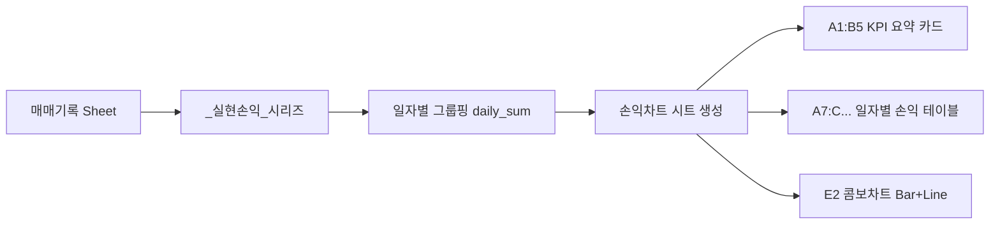

# 📊 [구현 계획서] Bitget V3 Switch 손익차트 (종합 / V3+ / V3-) 구현

본 문서는 `week_00-bitget_v3_switch` 프로젝트의 매매 기록 엑셀 파일(`trade_history.xlsx`)에 `떨사오팔봇`(`week_02-bitget_Ejftkdhvkf`)의 **'손익차트' 시트와 동일한 형식의 시각화 대시보드**를 구축하기 위한 상세 설계 및 실행 계획서입니다.

---

## 1. 개요 및 배경

### 1.1 요구사항 분석
1. **참조 모델**:
   - `떨사오팔봇`(`bitget_Ejftkdhvkf.py`)의 `손익차트시트_갱신()` 함수 및 `비트겟떨사오팔_매매기록.xlsx` 시트 구조 준용.
   - 상단 KPI 통계 요약 카드 (누적 실현손익, 청산 건수, 미청산 보유 건수, 기준시각 등).
   - 일별 손익/누적 손익 데이터 테이블.
   - `openpyxl` 기반 **콤보 차트(BarChart 일일 실현손익 + LineChart 누적 실현손익)** 렌더링.
2. **`v3_switch` 맞춤 확장 요구사항**:
   - `떨사오팔봇`은 단방향(롱) 단일 전략이나, `v3_switch`는 Hedge Mode 기반의 **양방향 2개 전략(`V3+` Long DCA, `V3-` Short DCA)**을 동시 운용함.
   - 따라서 차트 역시 **① 종합 실현손익 차트**, **② V3+ (롱) 실현손익 차트**, **③ V3- (숏) 실현손익 차트**를 모두 제공해야 함.

---

## 2. 참조 모델(`떨사오팔봇`) 구현 구조 분석



### 2.1 주요 스펙
| 항목 | 설정 내용 | 비고 |
| :--- | :--- | :--- |
| **KPI 요약 (A1:B5)** | • 누적 실현손익(USDT) (14pt Bold, Red `#C00000`)<br>• 청산 완료 건수, 미청산 건수, 기준시각(KST) | 가시성 극대화 |
| **데이터 테이블 (A7:C)** | • `기간` \| `일일 실현손익(USDT)` \| `누적 실현손익(USDT)`<br>• 일일 손익이 0인 날짜는 제외 | 손익 발생일 중심 정렬 |
| **막대 차트 (BarChart)** | • `type="col"`, `grouping="clustered"`<br>• SolidFill: `#5B9BD5` (소프트 블루)<br>• X축 세로 90도 회전 (`rot="-5400000"`으로 겹침 방지)<br>• Y축 천단위 구분기호 (`#,##0`) | 일일 손익 표시 |
| **꺾은선 차트 (LineChart)** | • SolidFill: `#C00000` (크림슨 레드), 두께 25000 EMU<br>• 원형 마커 (`symbol="circle"`, 크기 5) | 누적 손익 추이 표시 |
| **결합 방식** | `bar += line` 후 `ws.add_chart(bar, "E2")` | openpyxl 콤보 차트 |

---

## 3. `v3_switch` 데이터 파이프라인 및 스키마 개선

### 3.1 현재 상태 및 문제점
1. 현재 `trade_history.xlsx`의 `TradeHistory` 시트는 이벤트 기록 중심 (`BUY_UNIT`, `BUY_DUMMY`, `SELL_CLEAR`).
2. 청산(`SELL_CLEAR`) 시 산출된 `실현손익 ($)`과 `수익률 (%)`이 현재는 `비고` 컬럼의 텍스트(`... (손익: +123.45 USD, +2.34%)`)로만 기록됨.
3. 이를 개선하지 않고 텍스트 파싱에만 의존하면 집계 오류 및 성능 저하가 발생할 수 있음.

### 3.2 `TradeHistory` 스키마 고도화 (하위호환 유지)
`utils/excel_logger.py`의 `COLUMNS`를 다음과 같이 확장하여 정밀한 수치 필드를 명시적으로 보관합니다.

```python
COLUMNS = [
    "날짜/시간",
    "전략 구분",
    "이벤트 유형",
    "체결가 ($)",
    "수량 (Qty)",
    "실현손익 ($)",   # ✨ 신규: 청산 시 확정 손익 ($) 수치 저장
    "수익률 (%)",     # ✨ 신규: 청산 시 확정 수익률 (%) 수치 저장
    "유닛 번호",
    "더미 소진 현황",
    "총 평가 잔고 ($)",
    "비고"
]
```
> **참고**: 기존에 작성된 행이나 과거 이력이 있더라도, `실현손익` 컬럼이 비어있으면 `비고` 텍스트에서 정규식으로 자동 추출(Fallback)하도록 설계하여 하위 호환성을 완벽히 보장합니다.

---

## 4. `손익차트` 시트 레이아웃 및 차트 디자인 설계

V3 Switch의 특성을 가장 직관적으로 모니터링할 수 있도록 **[단일 통합 대시보드 시트]** 방식을 권장합니다.

```
┌────────────────────────────────────────────────────────────────────────────────────────┐
│ [A1:D5] 통합 KPI 요약 카드                                                               │
│  - 누적 손익 : 종합($) | V3+ 롱($) | V3- 숏($)                                         │
│  - 청산 건수 : 종합(N건) | V3+(N건) | V3-(N건)                                          │
│  - 미청산 상태: V3+ 보유수량/평단 | V3- 보유수량/평단                                      │
├──────────────────────────────────────────────────────┬─────────────────────────────────┤
│ [A7:G...] 일자별 상세 집계 데이터 테이블                  │ [I2 ~ X16]                      │
│                                                      │  📊 차트 1: 종합 실현손익 추이  │
│  - 기간                                              │     (합산 일일손익 + 누적손익)   │
│  - 종합 일일손익 / 종합 누적손익                       ├─────────────────────────────────┤
│  - V3+ 일일손익 / V3+ 누적손익                         │ [I18 ~ X32]                     │
│  - V3- 일일손익 / V3- 누적손익                         │  📈 차트 2: V3+ (롱) 실현손익   │
│                                                      ├─────────────────────────────────┤
│                                                      │ [I34 ~ X48]                     │
│                                                      │  📉 차트 3: V3- (숏) 실현손익   │
└──────────────────────────────────────────────────────┴─────────────────────────────────┘
```

### 4.1 상단 KPI 요약 테이블 (A1:D5)
| 행 | A (구분) | B (종합 Total) | C (V3+ 전략 / Long) | D (V3- 전략 / Short) |
| :---: | :--- | :---: | :---: | :---: |
| **1** | **지표 구분** | **종합 성과** | **V3+ (Long DCA)** | **V3- (Short DCA)** |
| **2** | **지금까지 누적 실현손익(USDT)** | `$0.00` *(Bold, Red)* | `$0.00` *(Bold, Blue)* | `$0.00` *(Bold, Orange)* |
| **3** | **청산 완료 건수** | `0 건` | `0 건` | `0 건` |
| **4** | **현재 미청산(보유) 현황** | 양방향 합산 포지션 | 보유 수량 & 평단 | 보유 수량 & 평단 |
| **5** | **기준시각(KST)** | `YYYY-MM-DD HH:MM:SS` | - | - |

### 4.2 일별 시계열 데이터 테이블 (A7:G...)
- `A열 (기간)`: `YYYY-MM-DD`
- `B열 (종합 일일손익)` / `C열 (종합 누적손익)`
- `D열 (V3+ 일일손익)` / `E열 (V3+ 누적손익)`
- `F열 (V3- 일일손익)` / `G열 (V3- 누적손익)`
- 서식: 숫자 셀 `0.00` 또는 `#,##0.00` 자동 포맷, 중앙/우측 정렬.

### 4.3 차트 3종 구성 스펙
1. **차트 1: 종합 실현손익 추이 (단위: USDT)** [배치: `I2`]:
   - 막대 (종합 일일손익): `#4472C4` (Royal Blue)
   - 꺾은선 (종합 누적손익): `#C00000` (Crimson Red, Circle Marker)
2. **차트 2: V3+ 전략 (Long DCA) 실현손익 추이** [배치: `I18`]:
   - 막대 (V3+ 일일손익): `#5B9BD5` (Sky Blue)
   - 꺾은선 (V3+ 누적손익): `#1F497D` (Navy Blue, Square Marker)
3. **차트 3: V3- 전략 (Short DCA) 실현손익 추이** [배치: `I34`]:
   - 막대 (V3- 일일손익): `#ED7D31` (Soft Orange)
   - 꺾은선 (V3- 누적손익): `#A5531B` (Deep Brown/Amber, Triangle Marker)

---

## 5. 단계별 상세 구현 작업

### Step 1: `utils/excel_logger.py` 고도화
1. `COLUMNS` 정의에 `실현손익 ($)`, `수익률 (%)` 추가.
2. `ExcelLogger.append_record()` 메서드 인자에 `realized_pnl: Optional[float] = None`, `pnl_pct: Optional[float] = None` 추가 및 셀 값/스타일 적용.
3. `손익차트시트_갱신(wb=None)` 메서드 신규 구현:
   - `TradeHistory` 시트에서 `SELL_CLEAR` 이벤트 필터링 및 일자별 집계 (`pd.DataFrame`).
   - `state.json` 로드하여 현재 미청산 수량/평단가 및 누적 손익 교차 검증.
   - `손익차트` 워크시트 재생성 (기존 시트 덮어쓰기).
   - A1:D5 요약 카드 생성 & 스타일(폰트, 배경, 테두리) 적용.
   - A7:G... 일자별 데이터 테이블 기록.
   - `BarChart` + `LineChart` 결합 콤보 차트 3종 생성 후 `I2`, `I18`, `I34`에 각각 앵커링.

### Step 2: `manager/trader.py` 연동
청산 집행 지점 4곳에서 `self.excel.append_record()` 호출 시 `realized_pnl`과 `pnl_pct`를 함께 넘기도록 수정:
1. `Strategy A (Long)` 일봉 1차 즉시 청산 (L108-118)
2. `Strategy B (Short)` 일봉 1차 즉시 청산 (L160-170)
3. `Strategy A (Long)` 4H 2단계 트레일링 청산 (L372-382)
4. `Strategy B (Short)` 4H 2단계 트레일링 청산 (L425-435)
청산 완료 직후 `self.excel.update_pnl_chart()` 자동 호출 트리거 연결.

### Step 3: CLI 및 독립 갱신 유틸리티 지원
1. `main.py`에 `--update-chart` 인수를 추가하여 언제든 명령어로 엑셀 차트 시트만 즉각 재빌드할 수 있도록 지원:
   ```bash
   python main.py --update-chart
   ```
2. 일봉 마감 파이프라인 종료 시에도 자동 호출되어 항상 최신 상태 유지.

---

## 6. 테스트 및 검증 시나리오

1. **스키마 및 생성 테스트**:
   - `trade_history.xlsx`가 없을 때/있을 때 정상 생성 및 헤더 포맷팅 검증.
2. **모의 거래 데이터 기반 렌더링 검증**:
   - V3+ 롱 매수 $\rightarrow$ 익절 청산, V3- 숏 진입 $\rightarrow$ 트레일링 익절 청산 모의 데이터를 삽입하여 `손익차트` 시트 생성 실행.
   - 생성된 엑셀 파일 열기:
     - A1:D5 요약 카드 수치 검증.
     - A7:G... 테이블의 기간별 일일/누적 손익 수치 일치 검증.
     - 차트 3종(종합, V3+, V3-)이 정상적으로 겹침 없이 렌더링되는지 확인.
     - X축 날짜 세로 회전(-90도) 및 Y축 숫자 서식 확인.
3. **하위 호환성 및 무결성 검증**:
   - 차트가 추가된 엑셀 파일에 새로운 매수/청산 행을 append할 때 차트 객체가 깨지지 않고 보존되는지 검증.

---

## 7. 대안 옵션 안내 (사용자 선택 가능)

| 옵션 | 구성 방식 | 장점 | 단점 |
| :---: | :--- | :--- | :--- |
| **옵션 1 (추천)** | **단일 통합 대시보드 시트 (`손익차트`)**<br>한 시트에 종합 + V3+ + V3- 3개 차트 나란히 배치 | 한눈에 전체 및 개별 전략 성과를 비교 분석 가능 | 시트 내 스크롤이 약간 필요할 수 있음 |
| **옵션 2** | **3개 시트 분리형**<br>`손익차트(종합)`, `손익차트(V3+)`, `손익차트(V3-)` | `떨사오팔봇` 원본과 100% 동일한 A~E열 단독 레이아웃 | 시트 탭을 클릭하여 이동해야 함 |
